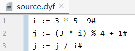
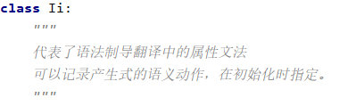
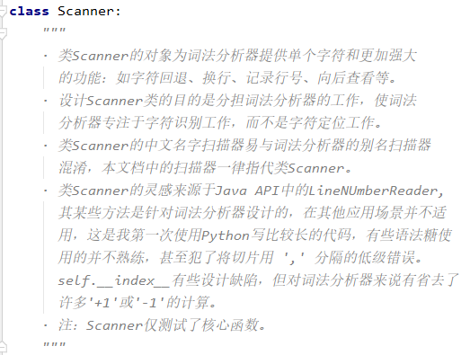
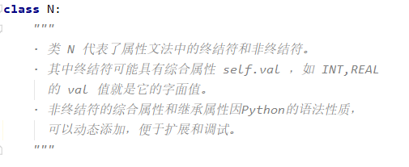

## 编译原理

* 语言简介   
  1.解释型语言   
  2.支持简单变量的赋值与四则运算   
  3.简单变量使用前需赋初值，否则报错   
  4.该语言以#作为语句分隔符   
  5.该语言的注释为// 或 /* */   
  6.源文件：\*.dyf，中间代码生成文件：\*.dyfc   
  7.源文件与中间代码生成文件均以UTF-8编码
* 正确语句输入示例：   
  
* 工具类简介   
  1.工具类所在的文件:   
     
  2.产生式.py中的类Ii:   
     
  3.扫描器.py中的类Scanner:   
     
  4.语法树结点.py中的类N:   
  
* 词法分析器简介   
  1.支持任何你能想到的关键字、保留字、运算符的识别   
  2.词法分析器接受字符流，输出终结符流   
  3.词法分析器与扫描器属于第二次设计，可复用性较好
* 语法分析器   
  1.可读性较差   
  2.类的设计的有瑕疵，属于赶时间的半成品
* 语义分析器   
  1.字面值在语义分析阶段就计算完成   
  2.设计与实现仅用一天，比较仓促，没有参考主流解释器的构造   
  **赋值与四则运算语句的文法：**
* S' -> S
* S-> V:=E
* V -> ID
* E -> E+T
* E -> E-T
* E -> T
* T -> T*F
* T -> T/F
* T -> T%F
* T -> F
* F ->(E)
* F-> ID
* F->i   
  注：i 代表字面值，如'REAL','INT'